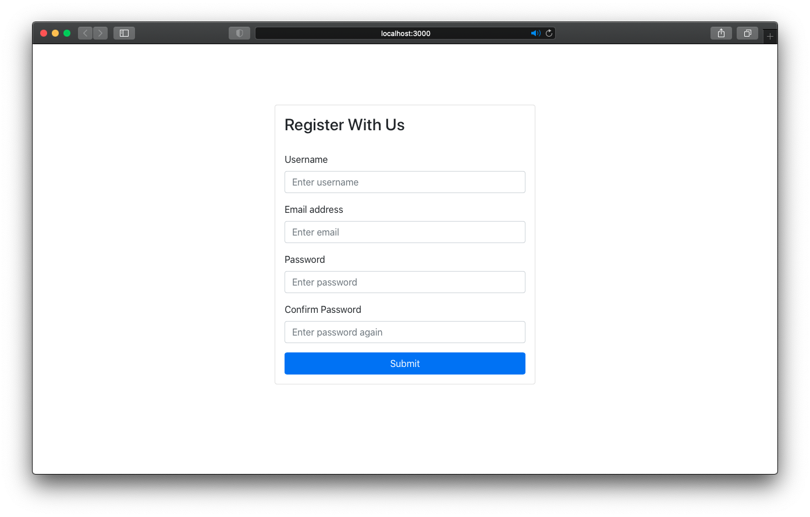
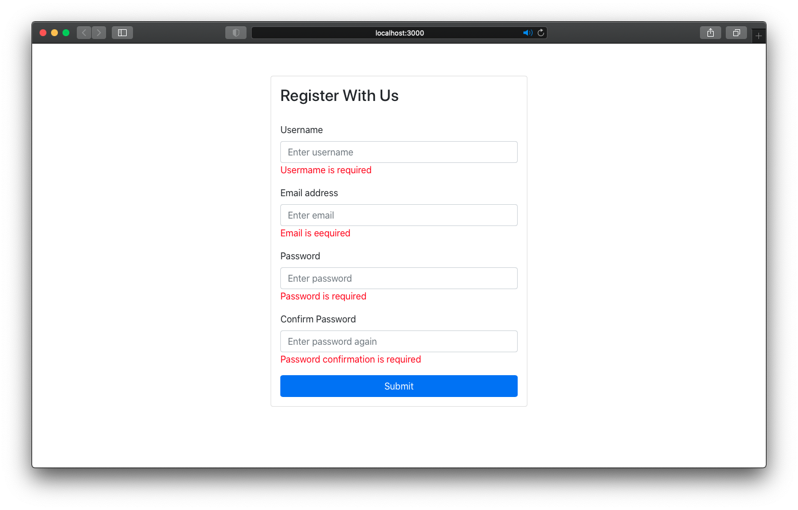

# Form Validation with ReactJS & Formik

## Introduction

The aim of this project is to develop a form validator for PEC 1 of the subject **Front-end development with JavaScript frameworks** of the UOC Master's Degree in Application Development for Mobile Devices. To do this we use the [React JS](https://https://es.reactjs.org) framework and [Formik](https://formik.org) for the form validation.

## The Application

The form contains the following fields with these limitations:

- **Username:** required and at least 3 characters
- **Email:** required and valid mail format
- **Password:** required, at least 6 characters, at least one uppercase letter, one lowercase letter, one number and one special character
- **Password confirmation:** required and same as password

## Resources

- [Bootstrap](https://getbootstrap.com)
- [ReactJS](https://reactjs.org)
- [Formik] (https://formik.org)
